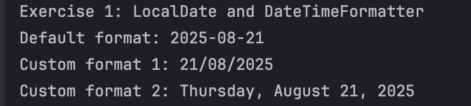
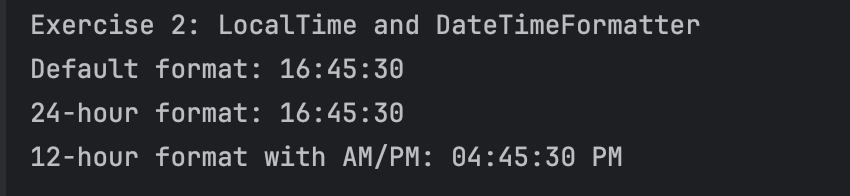
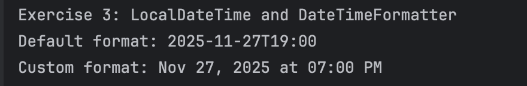
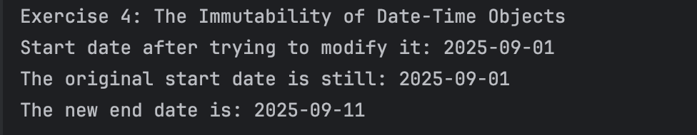
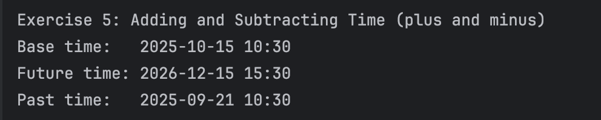
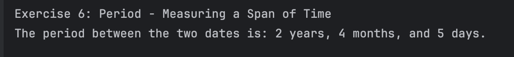

# Exploring Java Date and Time API
## Hands-on Lab: Working with Java's Date and Time API

Objective: To understand and use the LocalDate, LocalTime, and LocalDateTime classes for handling date and time, learn to format them using DateTimeFormatter, and perform calculations using Period and plus/minus methods.

## Author
Dzelle Faith R. Tan

## Output

---

---

---

---

---

